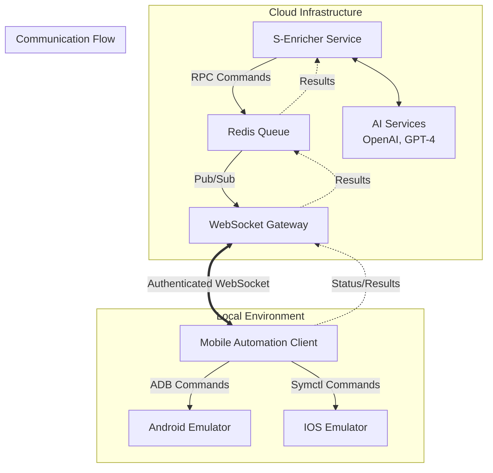
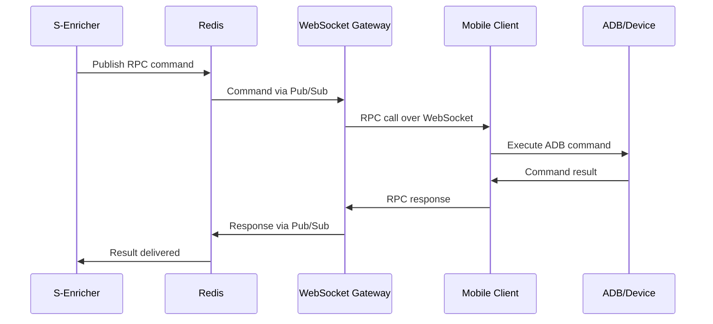
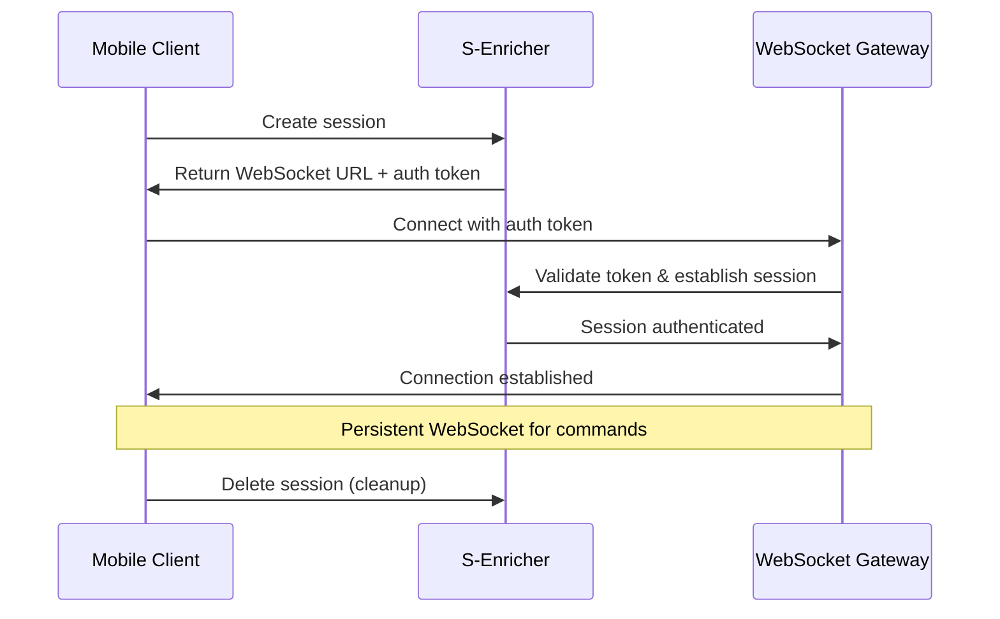

# System Design: Local Emulator Integration POC

## Executive Summary

This document outlines the system design for integrating **S-Enricher** with **local Android emulators and devices** through a distributed architecture. The solution enables cloud-hosted AI-driven test automation to control local development environments securely and efficiently.

## 0. Support Matrix (At-a-Glance)

### Platform Support
| Platform | Architecture | Status | Requirements |
|----------|--------------|--------|-------------|
| **macOS** | Intel x64 | ✅ Supported | HAXM, Android SDK, Xcode (iOS) |
| **macOS** | Apple Silicon (M1/M2) | ✅ Supported | Hypervisor, Android SDK, Xcode (iOS) |
| **Windows** | x64 | 🔄 Planned | Hyper-V/HAXM, Android SDK |
| **Linux** | x64 | 🔄 Planned | KVM, Android SDK |

### Device Support Matrix
| Device Type | Platform | Status | Limitations |
|-------------|----------|--------|-----------|
| **Android Emulator** (AVD) | All | ✅ Supported | API 21+ recommended |
| **Genymotion Desktop** | macOS/Windows | 🔄 Planned | Passthrough to existing gRPC |
| **Physical Android** (USB) | All | ✅ Supported | USB debugging enabled |
| **Physical Android** (Wi-Fi) | All | 🔄 Planned | Network ADB setup |
| **iOS Simulator** | macOS only | 🔄 Planned | Xcode 14+, iOS 14+ |
| **Physical iOS** | macOS only | ❌ Future | Complex provisioning |

### SDK & API Support
- **Android API Levels**: 21 (Lollipop) - 34 (Android 14)
- **iOS Runtimes**: iOS 14.0 - 17.x (when implemented)
- **Concurrent Devices**: Up to 4 per local client (configurable)

### Known Limitations
- **Antivirus Software**: Some real-time scanners interfere with ADB
- **Corporate Proxies**: TLS inspection may require certificate trust
- **Hypervisor Conflicts**: Cannot run multiple hypervisors simultaneously
- **GPU Requirements**: Hardware acceleration needed for performant emulators

## 1. Background and Objective

### Current State
- **S-Enricher**: Cloud-hosted mobile test automation service with AI-powered natural language test interpretation
- **Supported Providers**: Appetize.io (iOS/Android cloud) and Genymotion Cloud (Android cloud)
- **Limitation**: Cannot directly access local development environments behind firewalls/NAT

### Objective
Extend S-Enricher to work with local Android emulators and physical devices while:
- Maintaining security by keeping AI logic in the cloud
- Preserving existing provider architecture patterns
- Enabling real-time, low-latency automation commands
- Supporting multiple concurrent local clients

## 2. Architecture Overview



### Key Components

1. **S-Enricher Service**: Cloud-hosted orchestration with AI-powered test interpretation
2. **Redis Queue**: Message broker for reliable RPC communication
3. **WebSocket Gateway**: Secure bridge between cloud and local clients
4. **Mobile Automation Client**: Local service that executes device commands
5. **Device Layer**: Android emulators and physical devices via ADB

## 3. Communication Architecture

### 3.1 WebSocket + RPC Protocol

**Chosen Approach**: Authenticated WebSocket with RPC-over-WebSocket
- **Authentication**: Session-based tokens with 60-second TTL
- **Transport**: Persistent WebSocket connections for real-time communication
- **Protocol**: JSON-RPC style messages for command/response correlation

### 3.2 Message Flow

#### Command Execution Flow


#### Session Management Flow


### 3.3 Security & Trust Model

#### Threat Model
**Assets Protected**:
- Session tokens and authentication credentials
- Organization test data and screenshots
- Device control capabilities and ADB access
- Execution logs and performance metrics

**Threat Actors**:
- **Malicious local user/process**: Unauthorized device access or token theft
- **Network MITM**: Command interception or session hijacking
- **Compromised device**: Stolen laptop with active sessions
- **Insider threat**: Unauthorized test data access

#### Authentication & Authorization

**Device Enrollment** (🔄 **UNKNOWN - Need to Design**):
- OAuth device flow for pairing local client to S-Enricher organization
- Device registration with unique identifier and public key
- Organization-level device management and revocation

**Session Authentication** (✅ **KNOWN - Implemented**):
- Short-lived session tokens (60s TTL) with automatic rotation
- Long-lived refresh tokens stored in OS keychain
- Per-session nonce generation for replay protection

**Authorization Model** (🔄 **UNKNOWN - Need RBAC Design**):
- Role-based access control (RBAC) at command execution level
- Project/workspace isolation for multi-tenant environments
- Device capability restrictions based on user permissions

#### Transport Security

**Network Protection** (✅ **KNOWN - Implemented**):
- WSS (WebSocket Secure) with TLS 1.3
- Certificate pinning for S-Enricher endpoints
- Message-level nonces and timestamp validation

**Certificate Management** (🔄 **UNKNOWN - Need Implementation**):
- Automatic certificate rotation and validation
- Corporate proxy certificate handling
- Certificate revocation checking (OCSP)

#### Data Handling

**Screenshot & Media Security** (🔄 **UNKNOWN - Need Privacy Controls**):
- Opt-in/opt-out flags for screen capture
- PII masking regions and redaction hooks
- Local screenshot encryption before cloud transfer

**Secrets Management** (🔄 **UNKNOWN - Need Secure Storage**):
- OS keychain integration (macOS Keychain, Windows DPAPI, Linux Libsecret)
- No plain-text credential storage in configuration files
- Environment variable encryption for sensitive data

**Audit & Compliance** (🔄 **UNKNOWN - Need Audit Framework**):
- Comprehensive audit logging (connect/disconnect, commands, file transfers)
- Configurable log retention policies
- Organization-level audit export capabilities

## 4. Mobile Automation Client Design

### 4.1 Architecture Principles

**Action Layer Separation**: The local client implements only the action execution layer:
- ✅ Device interaction via ADB/platform tools
- ✅ Command parsing and validation
- ✅ Status reporting and error handling
- ❌ AI/ML inference or business logic
- ❌ Test interpretation or planning

### 4.2 Component Structure

```python
# Core Components
WebSocketMobileClient         # Main client orchestrator
ConnectionManager            # WebSocket connection with retry logic
AndroidDeviceManager         # Device discovery and management
AndroidRobot                 # ADB command execution

# Handler Pattern
_handle_mobile_launch_app()           # App lifecycle
_handle_mobile_click_on_screen()      # Touch interactions
_handle_mobile_take_screenshot()      # Screen capture
_handle_mobile_list_elements()        # UI hierarchy
```

### 4.3 Mobile Automation Client (Local Agent) Deep-Dive

#### Packaging & Distribution

**Client Distribution** (🔄 **UNKNOWN - Need Installer Strategy**):
- **macOS**: PKG installer with code signing and notarization
- **Windows**: MSI installer with Authenticode signing
- **Linux**: DEB/RPM packages with GPG signatures
- **Auto-update**: Staged rollout with rollback capability

**Installation Requirements** (✅ **KNOWN - Current dependencies**):
- Python 3.8+ runtime and pip dependencies
- Android SDK Platform Tools (ADB) - bundled or detected
- macOS: Xcode Command Line Tools for iOS support
- Platform-specific permissions (detailed below)

#### Permissions & System Access

**macOS Permissions** (🔄 **UNKNOWN - Need Permission Framework**):
- **Accessibility Access**: Required for UI automation and element detection
- **Screen Recording**: Required for screenshot and screen recording
- **Files & Folders**: Access to Android SDK and app data directories
- **First-run Onboarding**: Guided permission setup wizard

**USB & Device Access** (✅ **KNOWN - Current ADB setup**):
- **Android USB**: Automatic via ADB, requires "USB Debugging" enabled
- **Linux udev rules**: Automatic device recognition for Android
- **iOS Trust Prompts**: Manual trust establishment for real devices (future)

#### Dependency Management

**ADB Distribution Strategy** (🔄 **UNKNOWN - Need Bundling Decision**):
- **Option 1**: Bundle platform-tools with client installation
- **Option 2**: Detect system ADB with version compatibility checks
- **Option 3**: Hybrid - use system ADB if compatible, fallback to bundled

**iOS Tooling** (🔄 **UNKNOWN - Future iOS support**):
- **simctl**: Part of Xcode, detect and validate version compatibility
- **WebDriverAgent**: Build and lifecycle management strategy needed
- **Provisioning**: Code signing and certificate management

#### Resource Management

**Performance Controls** (🔄 **UNKNOWN - Need Resource Limits**):
```bash
# Resource limits per device session
MAX_CPU_PERCENT=50        # CPU usage cap per emulator
MAX_MEMORY_MB=2048         # Memory limit per emulator  
EMULATOR_BOOT_TIMEOUT=300  # Emulator startup timeout
HEADLESS_MODE=true         # Run emulators without UI
```

**Device Multiplexing** (✅ **KNOWN - Concurrent device support**):
- Support for up to 4 concurrent Android devices
- Per-device worker pools with isolated command execution
- Serialized input to prevent gesture conflicts

#### Observability & Debugging

**Local Diagnostics** (🔄 **UNKNOWN - Need Doctor Command**):
```bash
# Diagnostic CLI commands
drizz-agent doctor                    # Environment health check
drizz-agent devices                   # List available devices
drizz-agent test-connection           # Validate S-Enricher connectivity
drizz-agent test-device <device_id>   # Test device automation
```

**Metrics Collection** (🔄 **UNKNOWN - Need Telemetry Framework**):
- Connection uptime and reconnection frequency
- Command execution latency (p50/p95/p99)
- Device discovery and selection timing
- ADB command success/failure rates
- Local resource usage (CPU/Memory/Disk)

#### Device Control Implementation

**Direct ADB Approach** (vs. Appium Server)

| Aspect | ADB/Direct Approach ✅ | Appium Server Approach |
|--------|----------------------|----------------------|
| **Simplicity** | Lightweight, no server process | Additional server layer |
| **Performance** | Direct native commands | Abstraction overhead |
| **Control** | Full SDK access | Limited to Appium protocol |
| **Reliability** | Fewer moving parts | More complex failure modes |
| **Footprint** | Minimal resource usage | Higher memory/CPU usage |

**ADB Commands Used** (✅ **KNOWN - Implemented**):
```bash
# Core automation commands
adb shell input tap <x> <y>           # Touch interactions
adb shell input swipe <x1> <y1> <x2> <y2>  # Gestures  
adb shell input text "hello"          # Text input
adb shell uiautomator dump             # UI hierarchy
adb exec-out screencap -p              # Screenshots
adb shell am start -a android.intent.action.MAIN  # App launch
```

**Command Reliability** (✅ **KNOWN - Timeout & retry implemented**):
```python
@retry(max_attempts=3, backoff=exponential(base=1.0))
async def execute_adb_command(self, cmd: List[str]) -> subprocess.CompletedProcess:
    result = await asyncio.wait_for(
        asyncio.create_subprocess_exec(*cmd, ...),
        timeout=self.timeout
    )
    return result
```

## 5. Provider Integration Pattern

### 5.1 Unified Provider Architecture

S-Enricher supports multiple device providers through a common interface:

```python
# Existing providers
DeviceProvider.APPETIZE      # iOS/Android cloud devices
DeviceProvider.GENYMOTION    # Android cloud emulators  
DeviceProvider.LOCAL_CLIENT  # Local devices (NEW)
```

### 5.2 Integration Points

The LOCAL_CLIENT provider integrates with existing S-Enricher patterns:

1. **Factory Pattern**: `GetDriver(provider=DeviceProvider.LOCAL_CLIENT)`
2. **Action Performers**: Unified tap, swipe, text input interfaces
3. **Thread Management**: Session-based execution context
4. **Validation Pipeline**: Screen comparison and element detection

### 5.3 Backwards Compatibility

- Existing Appetize and Genymotion integrations unchanged
- Same API endpoints and test script format
- Consistent logging and error handling patterns

## 5.5 iOS Path Specifics (WebDriverAgent vs XCUITest)

### WebDriverAgent (WDA) Lifecycle Management

**WDA Build Strategy** (🔄 **UNKNOWN - Need iOS Implementation**):
- **Carthage/CocoaPods**: Dependency management for WDA build
- **Xcode 15 Compatibility**: Support for latest Xcode versions
- **Automatic Signing**: Provisioning profile management
- **Port Management**: Dynamic port allocation per iOS session

**Health Monitoring** (🔄 **UNKNOWN - Need WDA Health Checks**):
```bash
# WDA health check endpoints
curl http://localhost:8100/status       # WDA server status
curl http://localhost:8100/health       # Health check endpoint
```

### iOS vs Android Capability Matrix

| Capability | Android (ADB) | iOS Simulator (WDA) | iOS Device (WDA) |
|------------|---------------|--------------------|-----------------|
| **App Launch** | ✅ am start | ✅ App activation | ✅ App activation |
| **Touch/Tap** | ✅ input tap | ✅ Touch actions | ✅ Touch actions |
| **Text Input** | ✅ input text | ✅ Keyboard input | ✅ Keyboard input |
| **Screenshots** | ✅ screencap | ✅ xcrun simctl | 🔄 WDA screenshot |
| **App Background** | ✅ Force-stop | ❌ Limited control | ❌ Limited control |
| **Sensor Data** | ✅ ADB inject | 🔄 simctl location | ❌ Hardware only |
| **Push Notifications** | ✅ ADB intent | ❌ Simulator limitation | ✅ Real push |

**iOS-Specific Limitations** (🔄 **UNKNOWN - Need Workaround Strategy**):
- **Background App Control**: Limited compared to Android's force-stop
- **Typing Speed**: WDA typing may be slower than ADB text injection
- **System Alerts**: iOS permission dialogs require special handling
- **Pasteboard Access**: Clipboard operations need explicit WDA calls

### WDA vs Appium Bridge Comparison

**Direct WDA Approach** (Recommended):
- **Pros**: Lower latency, direct WebDriver protocol, fewer dependencies
- **Cons**: iOS-specific code, manual WDA lifecycle management

**Appium Bridge Approach**:
- **Pros**: Unified API across platforms, mature ecosystem
- **Cons**: Additional abstraction layer, Java/Node.js dependency

## 5.6 File & Media Pipeline

### Artifact Capture

**Screenshot Strategy** (✅ **KNOWN - Android implemented**):
```python
# Android screenshot
await adb_exec(["exec-out", "screencap", "-p"])  # Raw PNG bytes

# iOS screenshot (planned)
await simctl(["io", device_id, "screenshot", "--type=png"])  # File output
```

**Screen Recording** (🔄 **UNKNOWN - Need Video Pipeline**):
```bash
# Android screen recording
adb shell screenrecord --bit-rate 6000000 --time-limit 180 /sdcard/recording.mp4

# iOS screen recording
xcrun simctl io "iPhone 15" recordVideo --codec=h264 --mask=ignored recording.mov
```

**Recording Constraints**:
- **Android**: 180-second max segments, automatic rotation
- **iOS**: No built-in segment rotation, manual file management
- **Quality**: Configurable bitrate and resolution per platform

### Transfer Pipeline

**Artifact Upload Strategy** (🔄 **UNKNOWN - Need Secure Transfer**):
```python
# Pre-signed URL approach
async def upload_screenshot(screenshot_data: bytes, session_id: str):
    # Get pre-signed S3 URL from S-Enricher
    upload_url = await get_presigned_url(session_id, "screenshot.png")
    
    # Chunked upload with resume capability
    await chunked_upload(
        upload_url, 
        screenshot_data,
        chunk_size=1024*1024,  # 1MB chunks
        checksum="sha256"
    )
```

**Bandwidth & Cost Controls** (🔄 **UNKNOWN - Need Upload Policies**):
- **Compression**: PNG optimization, JPEG for non-critical screenshots
- **Selective Upload**: Only upload on test failure or explicit request
- **Retention**: Automatic cleanup based on organization policy
- **Deduplication**: Hash-based duplicate detection

### Storage & Lineage

**Artifact Organization** (🔄 **UNKNOWN - Need S3 Structure**):
```
s3://drizz-artifacts/
  org/{org_id}/
    runs/{run_id}/
      sessions/{session_id}/
        screenshots/
          step_{step_num}_{timestamp}.png
        recordings/
          session_{session_id}.mp4
        logs/
          client_{session_id}.jsonl
```

**Metadata Tracking** (🔄 **UNKNOWN - Need Asset Database**):
```json
{
  "artifact_id": "art_123",
  "run_id": "run_456", 
  "session_id": "sess_789",
  "step_number": 5,
  "artifact_type": "screenshot",
  "file_size": 245760,
  "checksum": "sha256:abc123...",
  "created_at": "2024-01-15T10:30:00Z",
  "retention_until": "2024-02-15T10:30:00Z"
}
```

## 6. RPC Protocol & Session Semantics

### 6.1 Message Schema & Versioning

**Protocol Version** (✅ **KNOWN - Implemented**):
```json
{
  "protocol_version": "1.0",
  "id": "request-uuid",
  "method": "mobile_launch_app",
  "params": {...},
  "timestamp": "2024-01-15T10:30:00Z"
}
```

**Error Taxonomy** (🔄 **UNKNOWN - Need Standardized Codes**):
```json
{
  "error": {
    "code": "TRANSIENT|PERMANENT|USER_ENV|PERMISSION|UNSUPPORTED",
    "message": "Human readable description",
    "details": {"retry_after": 5000, "max_retries": 3}
  }
}
```

### 6.2 Capability Negotiation

**Client Capabilities Advertisement** (🔄 **UNKNOWN - Need Feature Detection**):
```json
{
  "event": "ready",
  "data": {
    "platform": "ANDROID",
    "capabilities": {
      "screen_capture": true,
      "video_recording": true,
      "ui_automation": true,
      "sensor_injection": false,
      "network_control": false
    },
    "sdk_versions": ["21", "28", "30", "33"],
    "max_concurrent_sessions": 4
  }
}
```

### 6.3 Flow Control & Reliability

**Delivery Guarantees** (✅ **KNOWN - At-least-once**):
- At-least-once delivery via WebSocket acknowledgments
- Client-side deduplication using message IDs
- Server-side retry with exponential backoff

**Idempotency & Deduplication** (🔄 **UNKNOWN - Need Implementation**):
- Idempotency keys for non-idempotent operations (app launches, file operations)
- Client-side duplicate message detection with 5-minute window
- Server-side operation result caching

**Backpressure Management** (🔄 **UNKNOWN - Need Queue Limits**):
- Client queue depth limits (default: 50 pending commands)
- Server rate limiting per session (default: 100 commands/minute)
- Backpressure signals when client queue exceeds threshold

### 6.4 Concurrency & Resource Management

**Resource Tokens** (🔄 **UNKNOWN - Need Device Locking**):
- Per-device mutex to prevent interleaved touch gestures
- Screenshot operation queuing to avoid conflicts
- App lifecycle state synchronization

**Session Concurrency Model** (✅ **KNOWN - Serialized per session**):
```python
# Commands within a session are serialized
async def handle_session_command(session_id, command):
    async with session_locks[session_id]:
        return await execute_command(command)
```

## 7. Network & Enterprise Environment Support

### 7.1 Corporate Network Compatibility

**Proxy Support** (🔄 **UNKNOWN - Need Implementation**):
- HTTP/HTTPS proxy detection from environment variables
- Corporate TLS inspection certificate handling
- PAC (Proxy Auto-Configuration) file support
- NTLM/Kerberos authentication for authenticated proxies

**Firewall Requirements** (✅ **KNOWN - Single egress port**):
- Outbound HTTPS (port 443) for all communication
- No inbound ports required on client machines
- DNS allowlist for S-Enricher domains

### 7.2 Connectivity Resilience

**Offline/Intermittent Connectivity** (🔄 **UNKNOWN - Need Offline Queue**):
- Local command queueing during network outages
- Incremental result synchronization on reconnection
- Partial artifact upload resume capability

**Connection Fallbacks** (✅ **KNOWN - WebSocket over 443**):
- Primary: WSS over port 8675
- Fallback: WSS over port 443 (HTTPS compatible)
- Optional: HTTP polling fallback for restrictive environments

## 8. Technical Implementation

### 8.1 Message Formats

#### RPC Command (S-Enricher → Client)
```json
{
  "id": "cmd-uuid-123",
  "type": "rpc_call", 
  "method": "mobile_launch_app",
  "params": {
    "package_name": "com.example.app"
  }
}
```

#### RPC Response (Client → S-Enricher)
```json
{
  "id": "cmd-uuid-123",
  "type": "rpc_response",
  "success": true,
  "result": {
    "message": "Launched app: com.example.app"
  }
}
```

### 6.2 Session Management

**Redis Storage**:
```
session:context:{session_id} = {
  "provider": "LOCAL_CLIENT",
  "device_id": "emulator-5554", 
  "platform": "ANDROID",
  "session_metadata": {...}
}

ws-auth-token:{token} = session_id  # TTL: 60s
```

### 6.3 Error Handling & Reliability

#### Connection Resilience
- **Exponential Backoff**: Automatic reconnection with increasing delays
- **Token Refresh**: Automatic session recreation on auth failure
- **Health Checks**: Periodic ping/pong to detect connection issues
- **Graceful Degradation**: Proper cleanup on connection loss

#### Command Reliability
```python
@retry(max_attempts=3, backoff=exponential(base=1.0))
async def execute_adb_command(self, cmd: List[str]) -> subprocess.CompletedProcess:
    # Timeout protection
    result = await asyncio.wait_for(
        asyncio.create_subprocess_exec(*cmd, ...),
        timeout=self.timeout
    )
    return result
```

## 7. Deployment and Operations

### 7.1 Environment Configuration

**Client Configuration** (`.env`):
```bash
# S-Enricher connection
BACKEND_SERVER_URL=https://api.s-enricher.com
ADB_PATH=/Users/developer/android-sdk/platform-tools/adb

# Connection tuning
CONNECTION_RETRY_MAX=5
CONNECTION_RETRY_DELAY=1.0
CONNECTION_TIMEOUT=10
HEALTH_CHECK_INTERVAL=30
```

**Server Configuration**:
```bash
# WebSocket gateway
DRIZZ_WEBSOCKET_PORT=8675
DRIZZ_CLOUDFRONT_DOMAIN=https://api.s-enricher.com

# Provider support
ENABLE_LOCAL_CLIENT_PROVIDER=true
```

### 7.2 Docker Deployment

```yaml
# S-Enricher service roles
services:
  enricher-server:
    environment:
      CONTAINER_ROLE: server
    ports: ["8001:8001"]
      
  enricher-websocket:
    environment:
      CONTAINER_ROLE: websocket  
    ports: ["8675:8675"]
    
  enricher-worker:
    environment:
      CONTAINER_ROLE: worker
```

### 7.3 Local Client Deployment

```bash
# Install client
git clone mobile-automation-py
cd mobile-automation-py
pip install -r requirements.txt

# Configure environment
cp .env.example .env
# Edit .env with S-Enricher URL

# Start client
python src/client_main.py
```

## 8. Monitoring and Observability

### 8.1 Metrics and Logging

**Client Metrics**:
- Connection uptime and reconnection frequency
- Command execution latency and success rates
- Device availability and selection patterns
- ADB command failure analysis

**Server Metrics**:
- WebSocket connection counts by provider
- RPC command throughput and error rates  
- Session creation and cleanup statistics
- Redis queue depth and processing times

### 8.2 Debugging Tools

**Client Debug Logging**:
```python
logger.debug(f"Received RPC command: {method}")
logger.debug(f"Executing ADB command: {' '.join(cmd)}")
logger.info(f"Command result: success={success}, duration={duration}ms")
```

**Health Check Endpoints**:
```http
GET /health                    # Service health
GET /monitor/threads/stream    # Active sessions
GET /logs/{thread_code}        # Execution logs
```

## 9. Testing Strategy

### 9.1 Unit Testing
- **ADB Command Execution**: Mock subprocess calls, test error handling
- **WebSocket Message Handling**: Test RPC command routing and responses
- **Device Management**: Test device discovery and selection logic

### 9.2 Integration Testing
```python
async def test_end_to_end_automation():
    # Start local client
    client = WebSocketMobileClient()
    await client.start()
    
    # Execute test via S-Enricher API
    response = await s_enricher_client.execute_test(
        provider="LOCAL_CLIENT",
        script="Tap on login button\nEnter username: testuser"
    )
    
    assert response.status == "SUCCESS"
    # Verify local device received commands
```

### 9.3 Load Testing
- Multiple concurrent local clients
- High-frequency command execution
- WebSocket connection stability under load
- Memory and CPU usage profiling

## 10. Security Considerations

### 10.1 Attack Vectors & Mitigations

| Vector | Risk | Mitigation |
|--------|------|------------|
| **Token Replay** | Medium | Short TTL (60s), one-time use tokens |
| **Command Injection** | High | Input validation, parameterized ADB commands |
| **Device Access** | Medium | Explicit device selection, sandboxed execution |
| **Network Interception** | Low | WSS encryption, token-based auth |

### 10.2 Best Practices

- **Principle of Least Privilege**: Client only executes specific automation commands
- **Input Sanitization**: Validate all RPC parameters before ADB execution
- **Audit Logging**: Log all automation commands for security review
- **Session Isolation**: Each session has independent device access

## 11. Future Enhancements

### 11.1 iOS Support
- Extend local client to support iOS simulators via `simctl`
- Add WebDriverAgent integration for device testing
- Cross-platform device management abstractions

### 11.2 Performance Optimizations
- **Command Batching**: Group related ADB commands for efficiency
- **Caching**: Cache UI hierarchy and screen state between commands  
- **Parallel Execution**: Support multiple simultaneous device sessions

### 11.3 Advanced Features
- **Device Clustering**: Manage device pools across multiple local clients
- **Real-time Streaming**: Video/screen sharing for debugging
- **CI/CD Integration**: Automated test execution in development pipelines

## 12. Performance & SLOs

### Latency Budgets

**Connection Performance** (✅ **KNOWN - Current measurements**):
- **WebSocket Handshake**: < 300ms (current: ~150ms)
- **Session Creation**: < 500ms (includes authentication)
- **Command RTT**: p95 < 200ms for tap/swipe operations
- **Screenshot Capture**: < 1.5s (current: ~800ms)

**Device Management** (🔄 **UNKNOWN - Need Benchmarks**):
- **Device Discovery**: < 2s for USB devices, < 5s for network
- **Emulator Boot**: < 300s for cold start, < 30s for snapshot resume
- **App Launch**: < 10s for complex apps, < 3s for simple apps

**Throughput Targets** (🔄 **UNKNOWN - Need Load Testing**):
- **Commands/session**: Up to 100 commands per minute sustained
- **Concurrent sessions**: Up to 4 per local client
- **Parallel clients**: No server-side limit (client self-registers)

### Performance Monitoring

**Client-side Metrics** (🔄 **UNKNOWN - Need Instrumentation**):
```python
# Key performance indicators
metrics = {
    "command_latency_p95": 180,  # milliseconds
    "screenshot_duration": 750,   # milliseconds
    "connection_uptime": 0.999,   # percentage
    "device_discovery_time": 1.2, # seconds
    "memory_usage_mb": 256,       # client memory footprint
}
```

## 13. Rollout, Support & Operations

### Phased Rollout Strategy

**Phase 1: Internal Alpha** (✅ **KNOWN - Current POC**):
- Engineering team dogfooding with Android emulators
- Basic WebSocket RPC functionality
- Manual client installation and configuration

**Phase 2: Design Partners Beta** (🔄 **UNKNOWN - Need Partner Program**):
- Selected customer early access program
- Automated installer with guided setup
- iOS simulator support (macOS only)
- Enhanced error handling and diagnostics

**Phase 3: General Availability** (🔄 **UNKNOWN - Need GA Criteria**):
- Public release with marketing launch
- Windows and Linux client support
- Enterprise features (SSO, audit logging)
- Professional support and documentation

### Telemetry & Dashboards

**Operational Metrics** (🔄 **UNKNOWN - Need Monitoring Stack**):
- **Connection Health**: Active sessions, connection success rate, geographic distribution
- **Performance**: Command latency percentiles, error rates by command type
- **Usage Patterns**: Popular device types, session duration, peak usage times
- **Client Health**: Crash rates, update adoption, OS distribution

**Support Dashboards** (🔄 **UNKNOWN - Need Support Tools**):
- Real-time client status and connectivity
- Session replay and command history
- Error aggregation and trend analysis
- Performance degradation alerts

### Incident Response

**Runbook Topics** (🔄 **UNKNOWN - Need Operational Procedures**):
- **Connection Flaps**: Network instability, proxy issues, firewall changes
- **Clock Skew**: Time synchronization problems affecting token validation
- **Certificate Issues**: TLS/SSL problems, expired certificates, trust store issues
- **ADB Conflicts**: Port conflicts with existing ADB servers (port 5037)
- **WDA Stuck**: iOS WebDriverAgent unresponsive or crashed

**RACI Matrix** (🔄 **UNKNOWN - Need Ownership Definition**):
- **Agent Releases**: Engineering owns, DevOps approves, Support notified
- **Certificate Rotation**: Security owns, Engineering implements, Ops monitors
- **Incident Response**: Support triages, Engineering diagnoses, SRE escalates
- **Customer Communication**: Support owns, Product approves, Engineering advises

### Versioning & Compatibility

**Version Strategy** (🔄 **UNKNOWN - Need Version Policy**):
- **Semantic Versioning**: Major.Minor.Patch for client releases
- **Protocol Versioning**: Independent versioning for RPC protocol
- **Compatibility Matrix**: Supported combinations of client/server versions
- **Forced Upgrades**: Security or breaking changes require immediate update

**Backward Compatibility** (🔄 **UNKNOWN - Need Deprecation Strategy**):
- **N-1 Support**: Server supports previous major client version
- **Deprecation Timeline**: 6-month notice for breaking changes
- **Feature Flags**: Gradual rollout of new capabilities

## 14. Privacy, Legal & Licensing

### End-User Privacy

**Data Collection Transparency** (🔄 **UNKNOWN - Need Privacy Framework**):
- **Screenshots**: Clear opt-in consent with granular controls
- **Performance Telemetry**: Anonymized metrics collection with opt-out
- **Crash Reports**: Symbolicated reports with PII redaction
- **Local Logs**: User control over log retention and transmission

**Privacy Controls** (🔄 **UNKNOWN - Need User Settings**):
```json
{
  "privacy_settings": {
    "screenshot_capture": "opt_in",
    "telemetry_collection": "anonymized", 
    "crash_reporting": "enabled",
    "local_log_retention_days": 7,
    "pii_redaction": "automatic"
  }
}
```

### Licensing Compliance

**Third-Party Dependencies** (🔄 **UNKNOWN - Need License Audit**):
- **WebDriverAgent**: Apache 2.0 license (Facebook/Meta)
- **ADB/Android SDK**: Android SDK License Agreement
- **Apple Developer Tools**: Xcode and iOS SDK license terms
- **Python Dependencies**: Various open-source licenses (MIT, BSD, Apache)

**Customer Data Boundaries** (✅ **KNOWN - Current policy**):
- **App Binaries**: Never leave local machine unless explicitly authorized
- **Screenshots**: Transmitted only during active test sessions
- **Device Identifiers**: Used for session correlation, not stored long-term
- **Test Data**: Customer retains full ownership and control

## 15. Risks & Mitigations

### Technical Risks

| Risk | Likelihood | Impact | Mitigation |
|------|------------|--------|-----------|
| **iOS Simulator Fragility** | High | Medium | CI test matrix across Xcode versions, feature flags |
| **Corporate Proxy Breakage** | Medium | High | Explicit proxy support, HTTP fallback mode |
| **ADB Port Conflicts** | Medium | Medium | Configurable ADB server port, automatic conflict resolution |
| **WDA Xcode Updates** | High | High | Version pinning with canary testing, automated builds |
| **Certificate Expiration** | Low | High | Automated renewal, advance expiration alerting |

### Business Risks

| Risk | Likelihood | Impact | Mitigation |
|------|------------|--------|-----------|
| **Security Breach** | Low | Critical | Penetration testing before GA, security reviews |
| **Support Overload** | Medium | Medium | Comprehensive documentation, automated diagnostics |
| **Platform Restrictions** | Low | High | Legal review of platform terms, alternative approaches |
| **Performance Regression** | Medium | Medium | Continuous performance monitoring, rollback procedures |

### Operational Risks

**Client Distribution** (🔄 **UNKNOWN - Need Distribution Strategy**):
- **Code Signing**: Apple notarization requirements, Windows Authenticode
- **Auto-update Failures**: Rollback mechanism, staged deployment
- **Platform Policy Changes**: App Store restrictions, gatekeeper policies

**Scalability Constraints** (🔄 **UNKNOWN - Need Capacity Planning**):
- **WebSocket Gateway**: Connection limits, resource usage patterns
- **Redis Queue**: Message throughput, memory usage growth
- **S3 Storage**: Artifact volume growth, cost optimization

## 16. Conclusion

This architecture successfully extends S-Enricher's capabilities to local development environments while maintaining:

- ✅ **Security**: AI logic remains in secure cloud environment
- ✅ **Performance**: Direct ADB commands minimize latency  
- ✅ **Scalability**: Multiple concurrent clients and sessions
- ✅ **Reliability**: Robust error handling and reconnection logic
- ✅ **Maintainability**: Consistent with existing provider patterns

### Key Success Factors

1. **Iterative Development**: POC → Alpha → Beta → GA progression
2. **Strong Fundamentals**: Security, reliability, and performance built-in from day one
3. **Enterprise Ready**: Corporate network support, audit logging, compliance
4. **Developer Experience**: Simple installation, clear diagnostics, comprehensive docs
5. **Operational Excellence**: Monitoring, alerting, incident response procedures

The solution enables developers to leverage S-Enricher's AI-powered test automation against their local Android development environments, bridging the gap between cloud intelligence and local development workflows while maintaining enterprise-grade security and reliability.
